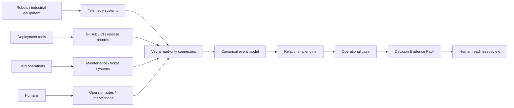
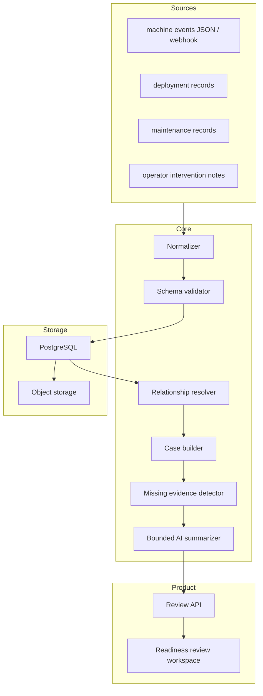
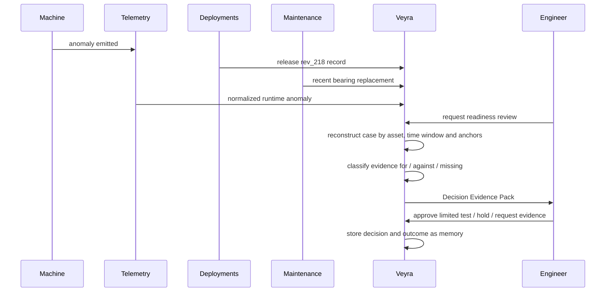

# Architecture

## System Context

Veyra runs beside existing operational systems. It does not sit in the machine control path.

## Component Architecture

## Return-To-Service Sequence

## Design Principles

1. Read-only by default.
2. Explicit relationships before inferred relationships.
3. Missing evidence is first-class.
4. AI summarizes only selected evidence.
5. Human decisions and outcomes become operational memory.
6. Storage stays boring until graph queries prove necessary.

